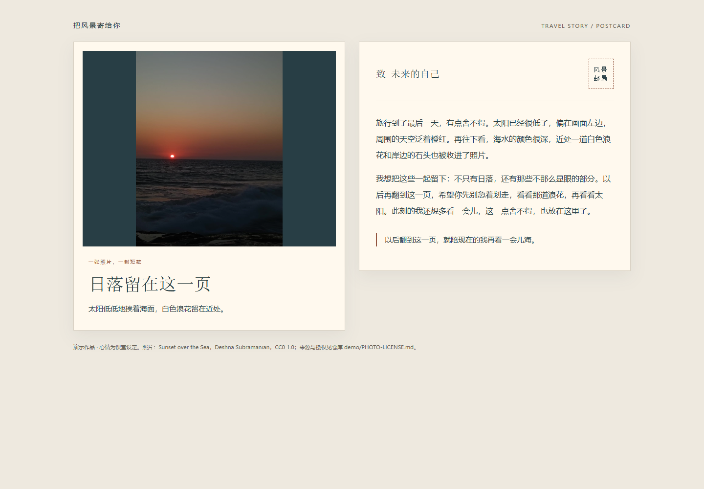
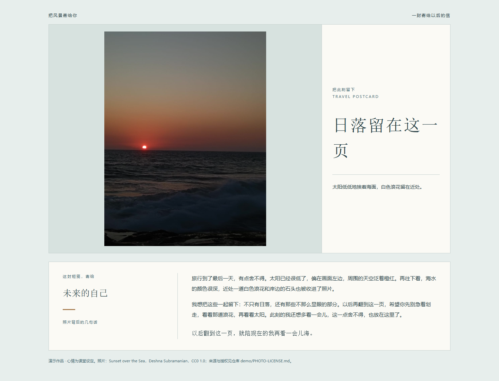

# 把风景寄给你｜旅行故事明信片

**一张旅行照片，一句心情，写给一个具体的人。**

`travel-story-postcard` 将原照片的细节写进标题、照片短句、背面故事和寄语，并根据照片设计排版。可以同图更换收件人、改语气、改长度或换布局；环境支持文件与截图能力时，默认交付正面 PNG、背面 PNG、总览图和可离线打开的 HTML。明确只要文案时只写文字。

**1.3.0：默认交付固定排版的图片。** 正面图含照片、标题和短句；背面图含故事、寄语与收件人；总览图方便检查。PNG 打开时不会重新排版，HTML 用于继续修改。截图前等待字体和图片加载，检查溢出；如果当前环境不能截图，会明确说明 PNG 未生成。

[正面 PNG](demo/png/postcard-front.png) · [背面 PNG](demo/png/postcard-back.png) · [总览 PNG](demo/png/postcard-overview.png)

**1.1.0：版式按照片设计，不固定套用 HTML。** 智能体可以重新编写结构与样式，渲染脚本通过 `--template` 接受任意本地创作的兼容模板；内置模板仅作参考和保底。此处是生成时重新设计，不是打开页面后随机变换。

**1.2.0：支持照片显示调整。** 可以用自然语言调整透明程度、完整显示/铺满、对齐位置、图框比例、底色和圆角；保持文案和原图字节不变。铺满可能裁切，需检查主体；默认完整展示。这些是明信片内的显示效果，不是另存一张修改像素后的照片。

GitHub 仓库：[Superxlb/-travel-story-postcard](https://github.com/Superxlb/-travel-story-postcard)。仓库名称开头有一个连字符；Skill 标识和目录名仍为 `travel-story-postcard`。



[查看示例 HTML 文件](demo/example-postcard.html) · [课堂演示说明](课堂演示说明.md) · [验证记录](VALIDATION.md)

另一种排版结构：[照片与标题侧栏、背面下置](demo/editorial-postcard.html)。两个示例都使用仓库内 CC0 照片，不限定只能在这两种样式中选择。



GitHub 的文件页通常展示源码；请下载仓库后用浏览器打开 HTML。图片预览不是交互网页；仓库不依赖 GitHub Pages。

## 输入与输出

| 你提供 | 你得到 |
| --- | --- |
| 必需：一张可读取照片，或明确的画面描述 | 一份完整明信片：标题、短句、故事、寄语与收件人 |
| 可选：心情、收件人、风格 | 适合关系和语气的原创表达 |
| 可选：地点、日期、署名 | 仅显示你给出的项目，不猜城市、不补日期 |
| 请求制作明信片（环境支持生成与截图） | 正面/背面/总览 PNG 与 HTML；能力不足时说明缺少哪些成品 |

默认寄给未来的自己，简体中文、温柔自然克制；没有心情时平实记录。支持温柔治愈、轻快俏皮、复古书信、简洁纪实。普通旅游攻略、订酒店、路线规划、纯修图不属于触发范围。

## WorkBuddy 安装：核实范围

2026-09-21 查阅了两处官方资料：[开放平台技能结构](https://open.workbuddy.cn/docs/skill)、[客户端技能安装说明](https://www.workbuddy.cn/docs/workbuddy/From-Beginner-to-Expert-Guide/Function-Description/Skills-Market)。官方说明了 `SKILL.md` 的 YAML + Markdown 结构、配套资源以及通过“添加技能 → 上传技能”导入本地包的入口。本包按此补充了中英文描述、版本、作者字段，保留通用 name/description；没有 Codex 专用配置。

**没有核实目标客户端版本的“GitHub URL 直接安装”功能，也未实际在 WorkBuddy 内导入本包。** 不把社区目录约定当官方路径，不提供未经核实的安装目录。`assets/` 是本包通过相对路径明确引用的资源目录，随包访问情况需在目标环境验证。

### 从 GitHub 获取，再本地导入

1. 在本仓库的 GitHub 页面下载源码 ZIP；发布者如提供 Release，优先取 `travel-story-postcard-skill.zip`。
2. GitHub 源码 ZIP 通常有外层仓库目录：先解压，找到含 `SKILL.md` 的根目录。如果需要重新打包，压缩该目录中的**内容**，使导入 ZIP 根部直接含 `SKILL.md`、`references/`、`assets/` 等。本次交付的 skill ZIP 已采用这种布局；目标客户端对压缩层级的解析仍需实际导入验证。
3. WorkBuddy 技能页面 → 添加技能 → 上传技能 → 选择本地包。此入口依据上述官方说明；导入若报错，保留错误信息核对当前客户端要求，不盲目复制到猜测目录。
4. 确认“已安装”中能找到此技能并处于启用状态，然后在对话中选择技能或用下方自然语言明确调用。

这条路径是“GitHub 分发 + 本地导入”，不是声称 WorkBuddy 支持直接粘贴仓库 URL。暂未发布到 GitHub 时，也可直接导入本次随附 ZIP。

### 更新

仓库更新不代表已安装副本自动同步。下载新包，按当前客户端支持的更新或重新导入方式处理，再检查加载到的 `version` 和示例行为；本包未实测目标客户端的更新流程。

## 调用示例

上传照片后：

> 请用 travel-story-postcard「把风景寄给你」把这张旅行照片写成明信片，寄给未来的自己。旅行最后一天，有点舍不得。请参考照片里的真实细节。

继续修改：

> 图片不变，改成寄给妈妈，少一点文艺感。

需要展示时：

> 用刚才的文案和原照片生成 HTML 明信片，正反面同时显示，尽量嵌图为单文件。

> 请把最终明信片正面和背面分别导出为 PNG，并直接展示图片，HTML 也保留。

换版式：

> 照片和文字都不变，重新设计排版。这次让照片更大，标题放侧边，背面在下方展开，用清爽的海蓝色。

调整照片：

> 文案和排版不变，把照片调淡一点，不透明度设为 85%，完整显示，加一点圆角。

> 把照片放进 4:3 的框里，尽量铺满，但保留人物。如果会裁掉人物，就改成完整显示。

> 恢复原图显示效果，取消透明效果和圆角，完整显示。

无需记住参数；智能体会转换成受校验的 `photo` 设置。开发用法见 [照片调整说明](references/photo-adjustments.md)，可运行数据见 [调整示例 JSON](demo/photo-adjusted-content.json)。

```sh
python scripts/render_postcard.py --data demo/photo-adjusted-content.json --image demo/sample.jpg --template demo/editorial-template.html --output outputs/photo-adjusted.html
```

[打开照片显示调整示例](demo/photo-adjusted-postcard.html)。此例使用 CC0 摄影，采用 85% 不透明度、完整显示和 16px 圆角。桌面预览见 [调整效果](demo/preview-photo-adjusted.png)。

不强制特定斜杠命令或 Codex 的 `$技能名` 语法；已加载状态以目标宿主实际显示和调用为准。

## 运行依赖与快速预览

- 文案：宿主智能体的语言能力；使用照片时还需读图能力。没有读图能力时可用明确的描述。本技能不额外调用付费 API、账号服务或网络；宿主本身的费用、联网与模型能力不由本包控制。
- 已生成 HTML：现代浏览器即可，图片已嵌入，无在线资源、无 JavaScript。
- 可选渲染脚本：Python 3.8+，仅标准库。它负责转义与嵌图，不自动识图或写故事。
- PNG：优先使用宿主现有浏览器截图工具。可选导出脚本需要 Node.js 20+、Playwright 与 Chromium/Chrome/Edge；这项依赖不影响文案和 HTML。[导出与依赖说明](references/png-export.md)。

从仓库根目录运行（选择尚不存在的输出文件）：

```sh
python scripts/render_postcard.py --data demo/example-content.json --image demo/sample.jpg --output outputs/my-postcard.html
```

双击 `outputs/my-postcard.html` 即可浏览。大图可加 `--image-mode relative`，将 HTML 与生成的同名前缀照片一起交付；只有描述时用 `--description-only`，成品明确标示没有照片。[详细字段说明](references/html-guide.md)。

上面的命令演示保底模板。使用本次重新设计的结构时，加 `--template 本次设计.html`；可运行例子：

```sh
python scripts/render_postcard.py --data demo/example-content.json --image demo/sample.jpg --template demo/editorial-template.html --output outputs/custom-postcard.html
```

依赖可用时导出图片（不会覆盖已有输出）：

```sh
node scripts/export_postcard.cjs --html outputs/custom-postcard.html --output-dir outputs/png
```

默认输出 `postcard-front.png`、`postcard-back.png`、`postcard-overview.png` 和对应 HTML 哈希记录。2 倍像素导出固定的是当前浏览器排版，不承诺专业印刷规格。

## 仓库内容

```text
travel-story-postcard/
├── SKILL.md
├── README.md
├── VALIDATION.md
├── 课堂演示说明.md
├── references/
│   ├── examples.md
│   ├── html-guide.md
│   ├── layout-design.md
│   ├── photo-adjustments.md
│   └── png-export.md
├── assets/postcard-template.html
├── scripts/
│   ├── render_postcard.py
│   └── export_postcard.cjs
├── tests/
│   ├── test_renderer.py
│   └── test_export.cjs
└── demo/
    ├── sample.jpg
    ├── PHOTO-LICENSE.md
    ├── example-content.json
    ├── example-postcard.html
    ├── preview-desktop.png
    ├── editorial-template.html
    ├── editorial-postcard.html
    ├── preview-editorial.png
    ├── photo-adjusted-content.json
    ├── photo-adjusted-postcard.html
    ├── preview-photo-adjusted.png
    └── png/
        ├── postcard-front.png
        ├── postcard-back.png
        ├── postcard-overview.png
        └── postcard-export.json
```

`examples.md` 是假设画面下的写作参考；模板含待替换变量；`demo/` 是真实公开照片与已填好的演示成品，三者不可混称。

## 测试与公开交付

运行脚本检查：`python -m unittest discover -s tests -v`。实际浏览器检查、文本行为检查和未完成的 WorkBuddy 集成验证，分别列在 [VALIDATION.md](VALIDATION.md)。这不是专业印刷包；普通浏览器打印结果需要检查分页。

可选浏览器导出检查：`node tests/test_export.cjs 实际浏览器路径`，验证真实截图、拒绝覆盖及坏图/外部资源/缺失区域/溢出的失败处理。测试环境需具备上述 PNG 依赖。

照片为 CC0 授权，作者与来源见 [PHOTO-LICENSE.md](demo/PHOTO-LICENSE.md)。演示文字的心情为课堂设定，不含私人经历。个人照片和私人内容请放在仓库外或已忽略的 `private/`、`outputs/`，公开发布前仍应复核待提交文件。

首次发布时，将**此目录内的内容**作为 GitHub 仓库根目录，保证打开仓库就能看到 `SKILL.md`，不要额外套一层文件夹。源码 ZIP 可作获取渠道；如使用 Release，上传根部含 `SKILL.md` 的 skill ZIP 便于导入。本包不包含密钥、账户配置或平台专用 agents 文件。
